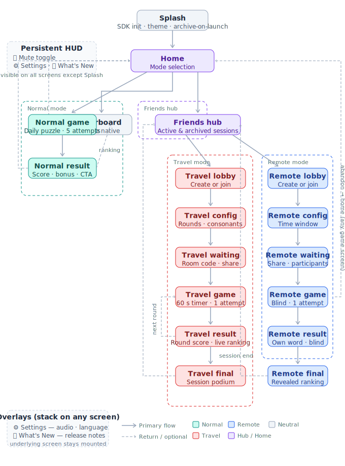

# Screen Map & Navigation Flows

## 1. Design Philosophy

PLATES has no URL-based routing. Navigation is a **React state machine** — a single
`AppScreen` enum drives which component renders. A hard browser refresh always returns to `SPLASH`, which re-runs session validation against the Worker (`PlatformService.initialize()`). This is intentional — there is no other moment where session state is checked.

The game is **silent on load by design** — not a persisted preference, since there is zero client-side persistence (see `AI_CONTEXT.md`, decision 7). It is a permanent browser autoplay-policy constraint: `AudioContext` requires a user gesture every load, regardless of any prior toggle. See `doc/technical/audio-engine.md` §5–6.

---

## 2. Screen Inventory

| ID | Screen | Description |
|---|---|---|
| `SPLASH` | Splash | SDK init, asset preload, theme resolution, archive-on-launch |
| `LOGIN` | Login | OAuth provider selection (Google initially). Reached from `SPLASH` when no valid session exists. |
| `HOME` | Home / Main Menu | Mode selection hub, persistent HUD visible |
| `SETTINGS` | Settings Overlay | Audio, language. Rendered as overlay — does not interrupt game state |
| `WHATS_NEW` | What's New Overlay | Release notes modal. Shown automatically post-update, accessible on demand |
| `NORMAL_GAME` | Normal Mode — Game | The puzzle engine in Normal Mode configuration |
| `NORMAL_RESULT` | Normal Mode — Result | Post-round result: score, word, plate bonus, leaderboard CTA |
| `FRIENDS_HUB` | Friends Hub | Entry point for Travel and Remote modes. Lists active and archived sessions |
| `TRAVEL_LOBBY` | Travel — Lobby | Create or join a Travel room |
| `TRAVEL_CONFIG` | Travel — Configuration | Host configures round count, consonant count |
| `TRAVEL_WAITING` | Travel — Waiting Room | Players joining, share link, start trigger |
| `TRAVEL_GAME` | Travel — Game | The puzzle engine in Travel Mode configuration |
| `TRAVEL_RESULT` | Travel — Round Result | Per-round result and live rankings |
| `TRAVEL_FINAL` | Travel — Final Ranking | Session-end podium |
| `REMOTE_LOBBY` | Remote — Lobby | Create or join a Remote room |
| `REMOTE_CONFIG` | Remote — Configuration | Host configures time window, word language |
| `REMOTE_WAITING` | Remote — Waiting Room | Shareable link, participant list, start trigger |
| `REMOTE_GAME` | Remote — Game | The puzzle engine in Remote Mode configuration (blind leaderboard) |
| `REMOTE_RESULT` | Remote — Result | Post-submission result (own word only — blind until window closes) |
| `REMOTE_FINAL` | Remote — Final Ranking | Revealed full ranking (available once all players submitted or time expired) |
| `LEADERBOARD` | YouTube Leaderboard | Native YouTube leaderboard overlay (ytgame SDK call) |

---

## 3. Persistent HUD

Always rendered on top of every screen except `SPLASH`.

| Element | Action |
|---|---|
| 🔇/🔊 | Toggles audio mute/unmute (`AudioRuntimeContext`) |
| ⚙️ | Opens `SETTINGS` overlay |
| 🔔 | Opens `WHATS_NEW` overlay. Shows a badge dot if unread notes exist |

Granular volume (music/SFX) will live inside the `SETTINGS` overlay once implemented.

The HUD does **not** include a back-navigation control. Each screen manages its own back/exit action contextually.

---

## 4. Navigation State Machine

### 4.1 Enum

```typescript
export type AppScreen =
  | "SPLASH"
  | "LOGIN"
  | "HOME"
  | "SETTINGS"          // overlay — stacks over current screen
  | "WHATS_NEW"         // overlay — stacks over current screen
  | "NORMAL_GAME"
  | "NORMAL_RESULT"
  | "FRIENDS_HUB"
  | "TRAVEL_LOBBY"
  | "TRAVEL_CONFIG"
  | "TRAVEL_WAITING"
  | "TRAVEL_GAME"
  | "TRAVEL_RESULT"
  | "TRAVEL_FINAL"
  | "REMOTE_LOBBY"
  | "REMOTE_CONFIG"
  | "REMOTE_WAITING"
  | "REMOTE_GAME"
  | "REMOTE_RESULT"
  | "REMOTE_FINAL"
  | "LEADERBOARD";
```

### 4.2 Overlay vs. Screen

Two categories of navigation targets:

- **Screen:** replaces the current render. Previous screen is unmounted.
- **Overlay:** renders on top of the current screen. Underlying screen remains mounted
  and preserves its state. `SETTINGS` and `WHATS_NEW` are always overlays.

### 4.3 State shape

```typescript
interface NavigationState {
  screen: AppScreen;
  overlay: "SETTINGS" | "WHATS_NEW" | null;
  sessionContext: SessionContext | null; // active room/round metadata
}
```

### 4.4 Allowed transitions



> Diagram maintained as `doc/functional/screen-flow.svg`. All updates are AI-generated —
> never edit the SVG manually. Request changes in natural language.

- `LEADERBOARD` is reachable from `HOME` and `NORMAL_RESULT`.
- Any screen → `HOME` is always valid (escape hatch / abandon session).
- Overlays (`SETTINGS`, `WHATS_NEW`) stack over any screen without changing `screen` state.
- The persistent HUD is always rendered except during `SPLASH`.
- `TRAVEL_RESULT` loops back to `TRAVEL_GAME` for each subsequent round; on the final
  round it proceeds to `TRAVEL_FINAL`.

---

## 5. Splash Screen Sequence

Theme resolution happens before Splash renders its first frame — purely local and
synchronous (see `doc/technical/theming-architecture.md`), no network dependency.

Splash resolves the session via `PlatformService.initialize()`. If a valid session exists, it navigates to `HOME`; otherwise it navigates to `LOGIN`. The What's New check (unread content opening the `WHATS_NEW` overlay) is not yet implemented — to be wired once that system exists.

**Note on timing:** there is no canonical-UTC-epoch fetch in this sequence. The cosmetic
date used for theme resolution is local-only. The authoritative UTC epoch used for
anti-cheat is never fetched preemptively in Splash — it is resolved lazily by the
Cloudflare Worker at score-submission time. See `doc/technical/security-anticheat.md`.

**Audio:** the Splash is silent. Browser autoplay policy blocks audio playback without a
prior user gesture, regardless of a player's saved `audio.enabled` preference. No
ambient/menu audio architecture is defined yet — see `doc/technical/audio-engine.md`.

If platform initialization fails (network unavailable), the game falls back to
`MemoryPlatform` behavior and displays a non-blocking offline warning banner.

---

## 6. Friends Hub Screen

Central lobby for all multiplayer activity. Replaces separate Travel/Remote entry points.

### Sections

**Active Sessions** — sessions in `IN_PROGRESS` or `WAITING` state, read from that room's Durable Object.

**Archived Sessions** —  sessions in `FINISHED` state, read from the `finished_rooms` D1 projection (see `doc/technical/worker-architecture.md` §9), never from a Durable Object directly..

**New Session** — two CTAs: `Travel Mode` → `TRAVEL_LOBBY` | `Remote Mode` → `REMOTE_LOBBY`.

---

## 7. Session Creation Flow (Travel & Remote)

Both modes share the same 3-step creation flow. Only the config screen fields differ.

```
[Mode]_LOBBY
    ├── "Create room" ──► [Mode]_CONFIG ──► [Mode]_WAITING (room created, share link active)
    └── "Join room"   ──► room code input ──► [Mode]_WAITING (joined)
```

### Share button
Present in `_WAITING` screen. Invokes native `navigator.share()` with room code and deep link.
Fallback: copy-to-clipboard.

### Room code
4-digit code generated by Cloudflare Worker. Displayed prominently in `_WAITING`.

---

## 8. Game Engine Contract

All three modes drive the same `<GameEngine />` component. Mode-specific behavior
is injected via a `GameConfig` plain data object (not a Context), making the engine
reusable across modes.

```typescript
interface GameConfig {
  mode: GameMode;                  // "NORMAL" | "TRAVEL" | "REMOTE"
  lang: string;                    // dictionary/plate language, e.g. "es"
  attemptsLimit: number;           // 5 (Normal) / 1 (Travel) / 1 (Remote)
  countdownSeconds: number | null; // null = no timer (Normal/Remote), 60 (Travel)
  consonants: string[];
  plateDigits: string;
  bonusType: PlateBonusType;
  initialAttemptsUsed: number;     // hydrated from enterNormalMode() response
  initialBestScore: number;
  initialAttemptsHistory: AttemptRecord[];
  onExit: () => void;              // navigate("HOME") — always available
}
```

**Normal Mode behavior:** the engine stays on `NORMAL_GAME` for the full session.
There is no "round complete" transition — the player submits up to `attemptsLimit`
words and the best valid score counts. Result overlays appear inline over the game
screen; dismissing them returns to the collapsed keyboard state on the same screen.
The player exits via the explicit exit button (`config.onExit`), not via a result
outcome.

**Travel / Remote Mode behavior (future):** each round will emit a result and the
parent screen will handle routing to the round-result screen. The exact contract
for multi-round modes is to be defined in the relevant implementation session.

`GameEngine` always keeps `GameRuntimeProvider` mounted — see
`doc/technical/state-architecture.md` §3 for the reason (orientation-change safety).

---

## 9. Orientation & Responsive Contract

Every supported surface — mobile (portrait and landscape), tablet, desktop, and in-vehicle infotainment displays — must render every screen correctly. Layout is **flex column** in portrait/narrow viewports, **flex row** in landscape/wide viewports.

---

## 10. What's New System — Access Patterns

Two ways to reach the `WHATS_NEW` overlay:

1. **Automatic:** triggered during Splash sequence when `lastSeenVersion < APP_VERSION`.
   Shown immediately after `HOME` renders, as an overlay.
2. **Manual:** via the `🔔` HUD button at any time. Badge dot cleared on first open.

Dismissing the overlay updates `lastSeenVersion` to `APP_VERSION` and persists it.